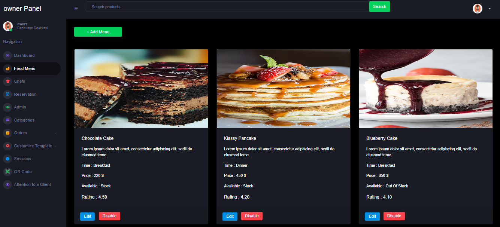
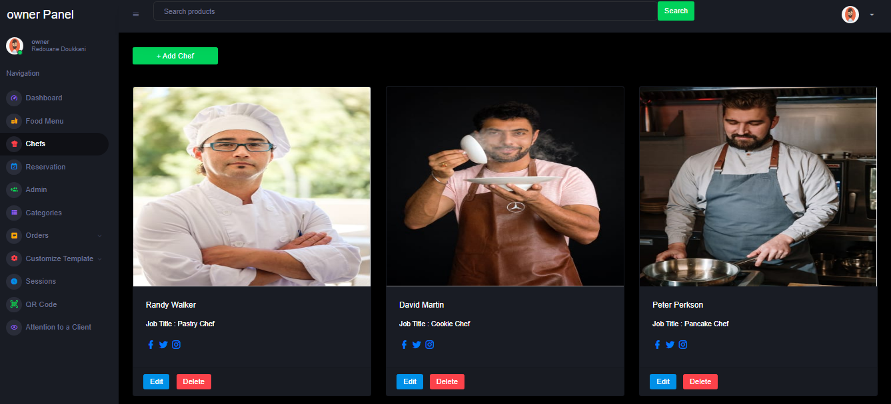

# Internship-Week4-MenuDigital
Internship-Week4-MenuDigital: Manage Admins, Reservations, Chefs, dishes, qrcode, sessions, digital menu and Categories and a Home Page for a Restaurant Website (with Laravel)

<h1><ins>Application Web de Gestion de Menu Numérique pour Restaurants</ins></h1>
<b>Objectif du Projet :</b> L'objectif de ce projet est de développer et mettre en œuvre une application web permettant de gérer des menus numériques pour les restaurants. Chaque responsable de restaurant pourra créer un compte et accéder à un tableau de bord client qui lui permettra de créer et gérer le menu de son établissement, les catégories de menu et les éléments de menu.
Il pourra également gérer les informations et les détails de son restaurant, visualiser le menu numérique et télécharger le code QR associé.
<h4><ins>Fonctionnalités pour les Responsables de Restaurant :</ins></h4>
<ol> 1. Créer un compte et accéder au tableau de bord.</ol>
<ol> 2. Créer et gérer le menu de l'établissement, les catégories de menu et les éléments de menu.</ol>
<ol> 3. Gérer les informations et les détails du restaurant.</ol>
<ol> 4. Visualiser et télécharger le menu numérique ainsi que le code QR correspondant.</ol>

<h4><ins>Fonctionnalités pour les Administrateurs :</ins></h4>
<ul> • Gérer et visualiser les comptes des clients.</ul>
<ul> • Accepter les demandes de création de compte.</ul>
<ul> • Consulter les plans d'abonnement.</ul>
<ul> • Désactiver ou activer un compte client.</ul>
<ul> • Établir une connexion avec un compte client.</ul>

<h4><ins>Fonctionnalités pour les Visiteurs :</ins></h4>
<ul> • Visualiser un menu numérique en scannant le code QR.</ul>
<ul> • Appeler le serveur/se la serveuse en utilisant l'application.</ul>
<ul> • En bonus : Possibilité de passer une commande à partir du menu numérique. Les commandes seront visibles par le responsable depuis son tableau de bord.</ul>

<h4><ins>Réalisations Attendues :</ins></h4>
<ul> • Mettre en place la conception UML de l'application de gestion de menu numérique.</ul>
<ul> • Intégrer les fonctionnalités existantes du projet précédent.</ul>
<ul> • Ajouter les fonctionnalités pour la gestion des comptes clients et administrateurs.</ul>
<ul> • Intégrer la possibilité de visualiser le menu numérique et de générer des codes QR.</ul>
<ul> • Mise en place de la possibilité de commander depuis le menu numérique.</ul>

<h4><ins>Technologies :</ins></h4>
<ul> • Continuer d'utiliser le framework Laravel.</ul>
<ul> • Utiliser le moteur de templating Blade pour les interfaces.</ul>
<ul> • Intégrer Bootstrap ou un autre framework CSS.</ul>
<ul> • Intégrer des fonctionnalités d'API et d'AJAX pour améliorer l'expérience utilisateur.</ul>

<h4><ins>Fonctionnalités Additionnelles (Bonus) :</ins></h4>
<ul> • Intégrer la possibilité de passer des commandes depuis le menu numérique.</ul>
<ul> • Afficher les commandes passées dans le tableau de bord du responsable.</ul>

<h4><ins>Modalites :</ins></h4>
<ul> • Travail individuel</ul>
<ul> • Temporalité : 10 jours</ul>
<ul> • Date Limite de soumission : le 28 août 2023</ul>


<h4><ins>Livrables :</ins></h4>
GitHub repo Link qui contient tous les éléments suivants :
1er Livrable : Le 17/08/2023 
<ul> ➢ Trello .</ul>
<ul> ➢ Structure projet Laravel ( Première version : Model , Controller , Migration , Blades ...).</ul>
<ul> ➢ La Conception UML .</ul>
2ème Livrable : Le 22/08/2023
<ul> Frontend complet ( Blade Laravel ).</ul>
3ème Livrable : Le 28/08/2023
<ul> ➢ Backend ( Laravel ).</ul>
----------------------------------------------------------------------------------------------------------------------------

# Restaurant

Welcome to Restaurant Website! This document provides step-by-step instructions to help you get started with the project.

## Prerequisites

Before you begin, make sure you have the following software installed:

- [Composer](https://getcomposer.org/)
- [Node.js](https://nodejs.org/)
- [npm](https://www.npmjs.com/)
- [PHP](https://www.php.net/)

## Installation

1. Clone the repository:

   ```bash
   git clone https://github.com/doukkani17moha/Internship-Week4-MenuDigital.git
   cd project-name

2. Install Composer dependencies:

   ```bash
   composer install

3. Install npm packages:

   ```bash
   npm install
   
4. Copy the .env.example file to .env:

   ```bash
   cp .env.example .env
   
5. Generate an application key:

   ```bash
   php artisan key:generate

6. Update the .env file with your database and other configuration settings.
   
7. Import the database:

   ```bash
   mysql -u yourusername -p yourdatabasename < rest.sql


## Running the Project

1. Start the development server:

   ```bash
   php artisan serve

2. Access the application in your web browser at http://localhost:8000.


## Additional Information

1. For Laravel Mix assets and styles, use npm run dev or npm run watch to compile assets:

2. Remember to keep your .env file secure and never share sensitive information.

If you encounter any issues or need further assistance, feel free to [contact us](mailto:mdoukkani8@gmail.com).

Happy coding!

------------------------------------------------------------------------------------------------------------------------
<br> <h4><ins>Client :</ins></h4> <br>
<h4 align="center" > <ins>Home Page</ins></h4>
<p align="center"></p>
<p align="center">-------------------------------</p>
<h4 align="center" > <ins>About Page</ins></h4>
<p align="center"></p>
<p align="center">-------------------------------</p>
<h4 align="center" > <ins>Menu Page</ins></h4>
<p align="center"></p>
<p align="center">-------------------------------</p>
<h4 align="center" > <ins>Contact Page</ins></h4>
<p align="center"></p>
<p align="center">-------------------------------</p>
<br> <h4><ins>Responsable :</ins></h4> <br>

<h4 align="center" > <ins>Login Page</ins></h4>
<p align="center"></p>
<p align="center">-------------------------------</p>
<h4 align="center" > <ins>Register Page</ins></h4>
<p align="center"></p>
<p align="center">-------------------------------</p>
<h4 align="center" > <ins>Home Page</ins></h4>
<p align="center"></p>
<p align="center">-------------------------------</p>
<h4 align="center" > <ins>Service Section</ins></h4>
<p align="center"></p>
<p align="center">-------------------------------</p>
<h4 align="center" > <ins>Dashboards Section</ins></h4>
<p align="center"></p>
<p align="center">-------------------------------</p>
<h4 align="center" > <ins>Testimonial Section</ins></h4>
<p align="center"></p>
<p align="center">-------------------------------</p>
<h4 align="center" > <ins>Plans Section</ins></h4>
<p align="center"></p>
<p align="center">-------------------------------</p>
<h4 align="center" > <ins>Plans Page</ins></h4>
<p align="center"></p>
<p align="center">-------------------------------</p>
<h4 align="center" > <ins>Payement Page</ins></h4>
<p align="center"></p>
<p align="center">-------------------------------</p>
<h4 align="center" > <ins>Thank You Page</ins></h4>
<p align="center"></p>
<p align="center">-------------------------------</p>
<h4 align="center" > <ins>Dashboard Page</ins></h4>
<p align="center"></p>
<p align="center">-------------------------------</p>
<h4 align="center" > <ins>Food Page</ins></h4>
<p align="center"></p>
<p align="center">-------------------------------</p>
<h4 align="center" > <ins>Chefs Page</ins></h4>
<p align="center"></p>
<p align="center">-------------------------------</p>
<h4 align="center" > <ins>Reservation Page</ins></h4>
<p align="center"></p>
<p align="center">-------------------------------</p>
<h4 align="center" > <ins>Admin Page</ins></h4>
<p align="center"></p>
<p align="center">-------------------------------</p>
<h4 align="center" > <ins>Categories Page</ins></h4>
<p align="center"></p>
<p align="center">-------------------------------</p>
<h4 align="center" > <ins>Pending Orders Page</ins></h4>
<p align="center"></p>
<p align="center">-------------------------------</p>
<h4 align="center" > <ins>Processing Orders Page</ins></h4>
<p align="center"></p>
<p align="center">-------------------------------</p>
<h4 align="center" > <ins>Completed Orders Page</ins></h4>
<p align="center"></p>
<p align="center">-------------------------------</p>
<h4 align="center" > <ins>Failed Orders Page</ins></h4>
<p align="center"></p>
<p align="center">-------------------------------</p>
<h4 align="center" > <ins>Home Template Page</ins></h4>
<p align="center"></p>
<p align="center">-------------------------------</p>
<h4 align="center" > <ins>About Template Page</ins></h4>
<p align="center"></p>
<p align="center">-------------------------------</p>
<h4 align="center" > <ins>Contact Template Page</ins></h4>
<p align="center"></p>
<p align="center">-------------------------------</p>
<h4 align="center" > <ins>Footer Template Section</ins></h4>
<p align="center"></p>
<p align="center">-------------------------------</p>
<h4 align="center" > <ins>Sessions Page</ins></h4>
<p align="center"></p>
<p align="center">-------------------------------</p>
<h4 align="center" > <ins>QR Code Page</ins></h4>
<p align="center"></p>
<p align="center">-------------------------------</p>
<h4 align="center" > <ins>Attention to a Client Page</ins></h4>
<p align="center"></p>
<p align="center">-------------------------------</p>
<br> <h4><ins>Admin :</ins></h4> <br>

<h4 align="center" > <ins>Dashboard Page</ins></h4>
<p align="center"></p>
<p align="center">-------------------------------</p>
<h4 align="center" > <ins>New Owners Page</ins></h4>
<p align="center"></p>
<p align="center">-------------------------------</p>
<h4 align="center" > <ins>Owners Page</ins></h4>
<p align="center"></p>
<p align="center">-------------------------------</p>
<h4 align="center" > <ins>Plans Page</ins></h4>
<p align="center"></p>
<p align="center">-------------------------------</p>

